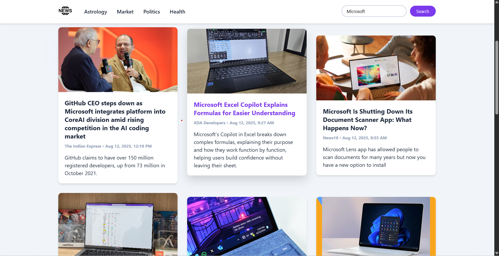
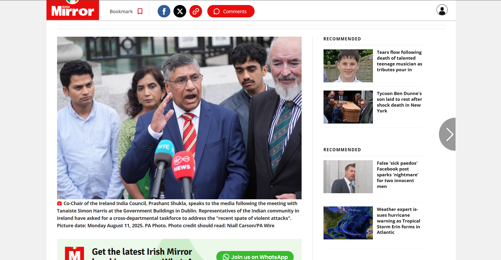

# NewsApi
A simple web application built with HTML, CSS, and JavaScript that fetches the latest news from an API and displays them in an easy-to-read format.

# Technologies Used-
1) HTML5 – Structure of the web app.
2) CSS3 – Styling and layout.
3) JavaScript – API calls and dynamic content rendering.

# How It Works
Fetches news data using the Fetch API in JavaScript.
Parses JSON response from the news API.
Dynamically updates HTML to show news headlines and details.

# Front-Page of dynamically updated website

# You can also search a news by keyword

# You can view decription of a news

